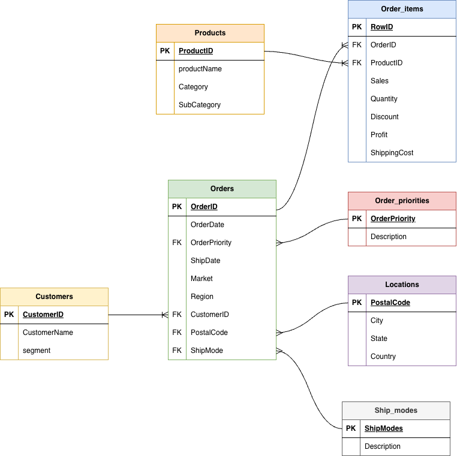
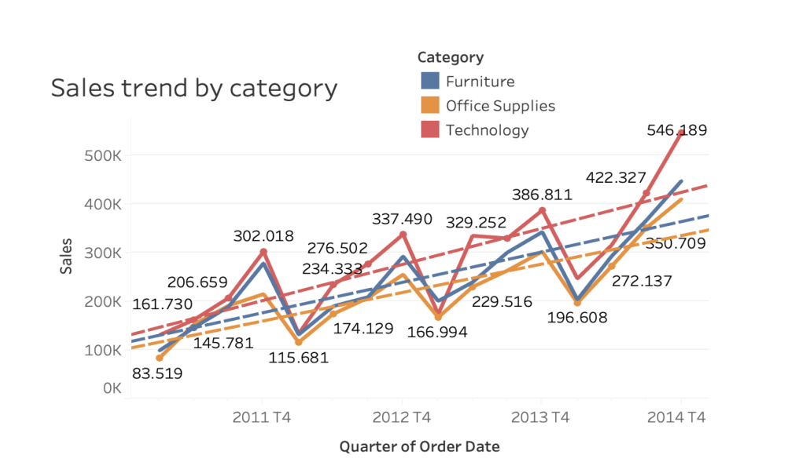
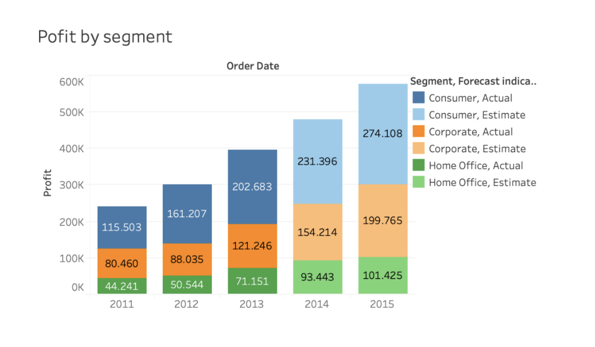
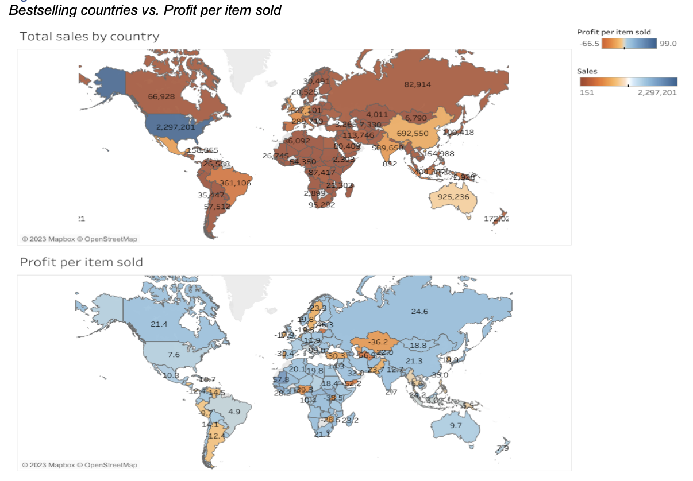
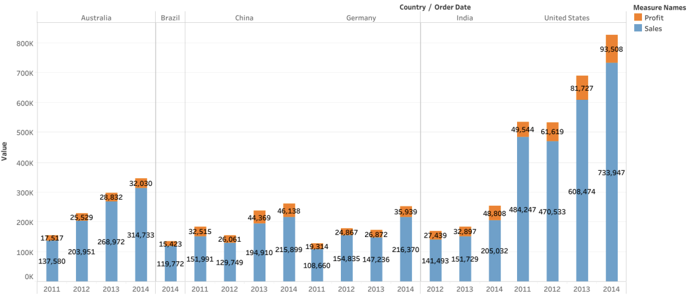
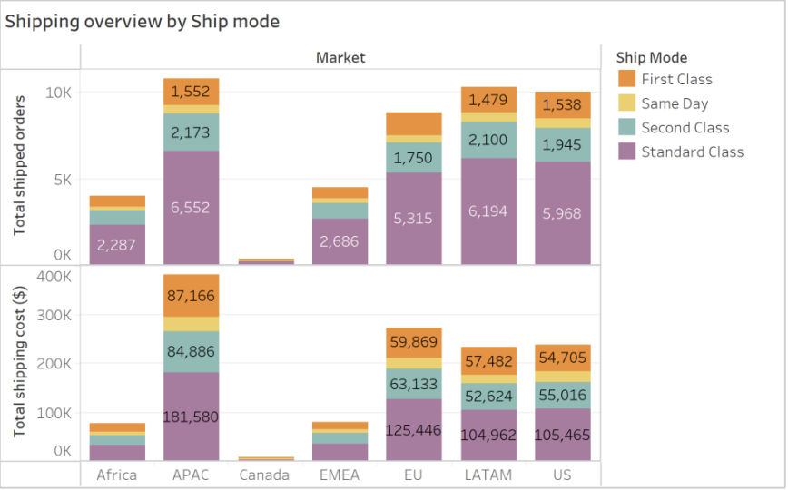
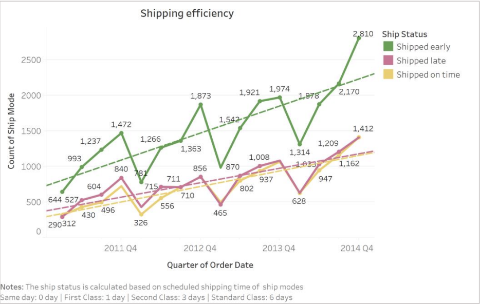

# Global Superstore Data Analysis
---

## Project Background

This project analyses sales data from an international e-commerce company operating in the appliances and technology sectors, serving both retail and office customers. The dataset, sourced from the Global Superstore, covers order transactions from 2011 to 2014 and offers valuable insights into sales, profitability, customer behaviour, and logistics.

The analysis aims to support decision-making in three key business areas:
- Improving profitability
- Understanding customer segmentation
- Optimising logistics

---

## Key Insights & Recommendations

Insights and recommendations are provided on the following key areas:

- **Profitability Growth:** Maximise profit by identifying key segments, products, and seasonal trends.
- **Customer Segmentation:** Target the most profitable customer groups and regions, and tailor incentives and marketing strategies.
- **Logistics Optimisation:** Reduce shipping costs and improve shipping efficiency to boost profitability and customer satisfaction.
- **Sales Trends Over Time:** Use data-driven insights to inform inventory and promotional strategies.
  
- Targeted SQL queries regarding various business questions can be found [here](sql/business_questions.sql).

---

## Data Structure & Initial Checks

The Global Super Store dataset consists of 51,290 rows and 24 columns and contains transactional data from an e-commerce business operating across multiple markets. The dataset includes information related to orders, customers, products, shipping, locations, and sales performance.

Prior to analysis, data review and quality checks were performed using SQL to assess completeness, consistency, and data types. These checks supported data cleaning and ensured the dataset was suitable for analysis.

The SQL queries used for data inspection and quality checks can be found [here](sql/data_quality_checks.sql).

## Design Decisions & Improvements
The ERD was designed as a normalised conceptual model to support transactional sales analysis.  
Certain business rules and design considerations were enforced at the database or analysis level rather than visually represented in the diagram.

- Each product appears only once per order (enforced via a composite uniqueness constraint on OrderID and ProductID).
- Metrics such as order lead time (ShipDate − OrderDate) are treated as derived values and calculated during analysis.
- Location data uses PostalCode for simplicity; a surrogate LocationID could be introduced in future iterations to avoid overlaps across countries.

The SQL constraint implementing the product-per-order business rule can be found in[Here](sql/constraints.sql).   

## Executive Summary

This report presents the creation of an analytical workbook for global e-commerce sales data. The dataset was cleaned and filtered using Tableau Prep and Desktop, correcting errors and removing irrelevant attributes. The analysis focused on three main business goals:
- Profitability growth
- Customer segmentation
- Logistics optimisation

Dedicated queries and tables enabled the generation of hypotheses and actionable recommendations to improve business efficiency and profitability. The results are presented in a storytelling format for stakeholder clarity.

---

## Insights Deep Dive

### Category 1: Improving Profitability

- **Seasonal Sales Trends:**  
  Quarterly analysis revealed technology items consistently had the highest sales, peaking in Q4 each year. The 2014 holiday season saw a 40% increase, with knock-on growth in furniture and office supplies. Post-holiday sales dropped by 36.3% for technology and also declined for other segments.
  

- **Segment Profitability:**  
  The consumer segment is the most profitable, followed by corporate and home office. Efficient marketing should prioritise consumer retention.
  

### Category 2: Understanding Customer Segmentation

- **Geographic Analysis:**  
  The US is the largest market, but APAC (China, India) and Brazil are important growth regions.  
  
  

- **Sensitivity to Incentives:**  
  Discount strategies should be tailored:  
  - China: Most sales without discounts  
  - Australia: Most sales with 10% discount  
  - US and Mexico: Retail price or ~20% discount  
  The US has low profit per item; consider raising prices cautiously.

### Category 3: Optimising Logistics

- **Shipping Costs:**  
  Standard Class is used for nearly 60% of orders worldwide. LATAM and US markets have lower shipping costs compared to EU, APAC, and EMEA.
  
  

- **Shipping Performance:**  
  Late shipments are trending upwards, especially for Office Supplies (binders, art).  
  
  

---

## Recommendations

Based on the findings, we recommend:

- **Sales & Marketing:**  
  - Use seasonal trends to adjust marketing and inventory strategies, especially for technology and furniture during Q4.
  - Prioritise retention and loyalty programs for consumer segments.
  - Focus growth efforts on APAC and Brazil, and review low-profit regions for potential withdrawal.
  - Tailor discount and pricing policies by region—avoid blanket approaches.

- **Logistics:**  
  - Improve shipping efficiency, particularly for Office Supplies.
  - Establish more regional warehouses in APAC and EU to lower costs and speed up delivery.
  - Redesign shipping routes and add local storage facilities.

- **Data & Ethics:**  
  - Enhance data collection and cleaning processes to ensure reliability.
  - Always consider legal and ethical practices, especially with customer data and pricing.

---

## Assumptions and Caveats

- Missing or inconsistent data, especially in postal codes, was removed or corrected.
- Typographical errors in city/state/country columns were manually fixed.
- Dates reformatted for consistency.
- Outliers in shipping cost and sales retained for future analysis.
- Ethical considerations in segmentation (no sex or ethnicity used).

---

## 📁 Downloadable Work Samples

- [Full Report PDF](link-to-report)
- [SQL Cleaning Queries](link-to-sql-cleaning)
- [SQL Business Questions](link-to-sql-business-questions)

---

## 📬 Contact

For questions or collaboration, connect on [LinkedIn](https://www.linkedin.com/in/dana-lucia-mendoza-64157b269/)  
Email: Dmzuleta65@gmail.com

---

